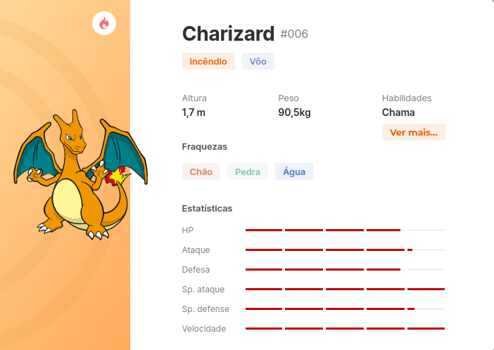

# pokemon_database
## 🎯 Objetivo
O objetivo principal do trabalho é modelar um banco de dados relacional para um dado problema e realizar um conjunto de consultas SQL nesse banco.

## 💃 Descrição
Os alunos deverão modelar um banco de dados a partir do conjunto de requisitos descritos na seção 2.

Quando os requisitos descritos não forem suficientes para fazer a modelagem, os alunos devem descrever o que eles estão supondo como requisitos para fazer a modelagem. Ex: se em um dado requisito gerar um tipo de relacionamento, mas não for possível estabelecer cardinalidade do mesmo ou a restrição de participação, os alunos deverão descrever o que será assumido nesse caso.

O trabalho é dividido em etapas. Em cada etapa uma tarefa (ou um conjunto de tarefas) deve ser realizado, conforme descrito a seguir:

[ ] Tarefa 1: Modelar o banco de dados usando o Modelo Entidade-Relacionamento (Estendido se necessário). Para esta atividade, o DER deve ser usado. É importante que os requisitos adicionais definidos pelos alunos sejam também entregues e modelados. Para cada um dos itens descritos na seção 2, os alunos devem informar como estes foram modelados usando o Modelo Entidade-Relacionamento. Um dicionário de dados deve ser desenvolvido para descrever cada tabela e cada atributo da modelagem.

[ ] Tarefa 2: Converter o modelo entidade relacionamento para o modelo relacional, comentando quais escolhas foram feitas para a conversão de cada uma das entidades, relacionamentos, hierarquias e agregações. O comando SQL de cada tabela deve ser fornecido.

## ✅ Requisitos
Há mais de 20 anos, crianças do mundo inteiro vêm descobrindo o mundo encantado de Pokémon e muitas delas se tornam fãs para a vida toda. Hoje, a família de produtos Pokémon inclui videogames, o jogo de cartas Pokémon Estampas Ilustradas, uma série de animação, filmes, brinquedos, livros e muito mais. Tanto os videogames Pokémon quanto o Pokémon Estampas Ilustradas incentivam o pensamento estratégico, além de habilidades de leitura e matemática. Pokémon também enfatiza o espírito esportivo e o respeito por outros jogadores.

### O que são Pokémons?

Pokémon são criaturas de todas as formas e tamanhos que podem ser selvagens ou então aparecer ao lado de seus parceiros humanos (chamados de “Treinadores”). Durante suas aventuras, os Pokémon crescem e se tornam mais experientes e até, ocasionalmente, evoluem para se tornarem Pokémon ainda mais fortes. Centenas de Pokémon conhecidos habitam o universo Pokémon, com números incontáveis ​​esperando para serem descobertos.

PokéBalls (Pokébolas): item utilizado para capturar pokémons selvagens e adicioná-los à sua equipe de monstrinhos. Pokébolas podem ser adquiridas gratuitamente em PokéStops ou compradas na Loja. É importante observar que existem diferentes tipos de Pokébolas, cada uma com seu nível de força (normais, Great Balls, Ultra Balls e Master Balls).

Trainer (Treinador): alcunha oferecida aos jogadores de Pokémon GO. Treinadores são aqueles que capturam pokémons selvagens e os domesticam para batalhar contra outros indivíduos.

A seguir, é apresentado na Figura 1 as características básicas de um Pokémon:

- Todo Pokémon possui Nome, Altura, Peso, Habilidades (uma ou mais), Fraquezas (uma ou mais), Tipo (podem ser de um ou mais tipos) além de atributos estatísticos que variam de 0 a 100: HP (Health Point) é a famosa barra de vida, Ataque, Defesa, Ataque Especial (Sp. ataque), Defesa Especial (Sp. defesa) e Velocidade.
- Cada treinador tem um nome, um identificador único e XP (Pontos de experiência, maior ou igual a zero).
- Cada treinador por ter N pokébolas, que pode ou NÃO ter um pokémon dentro. Logo, há pokémons que não estão em nenhuma pokébola.
- Cada pokémon pode EVOLUIR para novos pokémons com atributos e características que podem ser diferentes do pókemon anterior. O sistema deve armazenar todas as possíveis evoluções de um determinado pokémon.

- 128 treinadores podem participar de um Campeonato Pókemon. Não há limite de pokémons por treinador.
- Os duelos (batalhas) acontecem de maneira similar aos games e animes da franquia Pokémon. Os treinadores escolhem três Pokémons que usarão na batalha. Cada um pode utilizar dois escudos de proteção e ataque carregados e vence o primeiro que eliminar todos os Pokémons do oponente.
- Inicialmente são disputados 64 batalhas, onde cada confronto foi sorteado previamente entre os participantes do torneio. Os 64 vitoriosos seguem para a próxima fase. Na próxima fase, 32 batalhas definem os 32 vitoriosos para a próxima fase. Esse mecanismo eliminatório segue até sobrarem apenas dois treinadores para a grande final.
- O sistema deve registrar data, horário, treinadores e pokémons participantes de cada batalha. É importante anotar também o horário em que cada pokémon foi escolhido para a batalha (sai da pokébola) e também quando ele volta. Lembre-se, sempre que um treinador escolher um novo pokémon para a batalha, o que estiver na arena de batalha deve voltar para a sua pokébola.
- Para cada ataque realizado por um pokémon dentro de uma batalha também deve-se guardar o nome to ataque utilizado e o total do dano causado ao pokémon oponente.

## 📊 Relatórios
- Crie uma visão (view) que liste os nomes dos pokémons mais utilizados pelos treinadores ao fim do campeonato.
- Crie uma visão (view) que liste o nome dos top 5 treinadores com a maior soma de danos causados pelos ataques dos seus pokémons durante as partidas.
- Crie uma visão (view) que liste os nomes dos pokémons que evoluiram durante as partidas (nome antes da evolução, nome depois da evolução).
- Quantos pokémons de cada tipo existem? Crie uma consulta que responda esta pergunta.
- Qual o tipo de pokémon que mais acumulou derrotas ao final do torneio?
- Crie uma visão (view) que liste o quadro final de classificação do torneio, ordenado pelo número de vitórias. Treinadores com o mesmo número de vitórias devem ser listados em ordem lexicográfica.